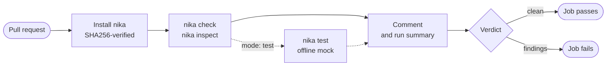

<p align="center">
  <a href="https://nika.sh">
    <picture>
      <source media="(prefers-color-scheme: dark)" srcset="https://nika.sh/brand/nika-logo-dark.svg">
      
    </picture>
  </a>
</p>

<h1 align="center">supernovae-st/nika-action@v1</h1>

<p align="center">
  <strong>Every pull request that changes an AI workflow gets a clear verdict, before anything runs.</strong><br>
  One comment per <code>.nika</code> file with the verdict, a cost floor, the models and secrets it needs, and its graph. No API key.
</p>

<p align="center">
  <a href="https://github.com/supernovae-st/nika-action/releases/latest"></a>
  <a href="https://github.com/supernovae-st/nika-action/actions/workflows/ci.yml"></a>
  <a href="https://github.com/supernovae-st/nika/releases/latest"></a>
  <a href="https://docs.nika.sh"></a>
  <br>
  <a href="https://scorecard.dev/viewer/?uri=github.com/supernovae-st/nika-action"></a>
  <a href="https://archive.softwareheritage.org/browse/origin/?origin_url=https://github.com/supernovae-st/nika-action"></a>
  <a href="LICENSE"></a>
</p>

<!-- engine clips: served from the engine repository's main branch (media/), so they follow its latest render, not a release tag · each clip's plate names the engine version its output was captured from -->
<p align="center"><b>Watch this action's comment on a pull request: one finding on the first push, clean after the fix.</b></p>
<p align="center">
  <a href="https://raw.githubusercontent.com/supernovae-st/nika/main/media/gifs/pr-check-comment.optimized.gif">
    
  </a>
</p>
<p align="center"><sub>Notice the finding's hint (<code>NIKA-DAG-002</code>, "did you mean <code>assess</code>?"), then the same comment edited in place, clean, with the graph. Every word of both comments is this action's own renderer on real <code>nika check --json</code> and <code>nika inspect</code> output; the pull-request page around them is an illustration. Click to open it full size.</sub></p>

## What is Nika?

Nika turns repeatable AI work into a small file you keep. Say what you
want done, like *"every Monday, pull the action items out of my meeting
notes"*, and Nika writes it as a readable `.nika` workflow. Before
anything runs, `nika check` shows what the workflow will do, which models
and tools it uses, what it is allowed to touch and what it can cost,
without calling a model. You run it when you decide, with the model you
choose, local or cloud, and every run leaves a tamper-evident record you
can verify. One Rust binary, local-first, open source (AGPL-3.0).

| 1 · Say it | 2 · Check it | 3 · Run it | 4 · Prove it |
|:---:|:---:|:---:|:---:|
| Describe the job; Nika writes a `.nika` file | `nika check` audits it before any model is called | `nika run` with the model you choose | `nika trace verify` checks the run's record |

> [!TIP]
> **This action is step 2, on every pull request.** It runs `nika check` on
> the workflow files you name and posts the result as one comment. Findings
> fail the job. It never does step 3: no real run, no model call, no key.

<p align="center">
  <a href="#quick-start">Quick start</a> ·
  <a href="#the-comment-on-your-pull-request">The comment</a> ·
  <a href="#how-it-works">How it works</a> ·
  <a href="#reference">Reference</a> ·
  <a href="#security">Security</a> ·
  <a href="#faq">FAQ</a>
</p>

## Quick start

**1 · Add the job.** Create `.github/workflows/nika.yml`:

```yaml
name: nika
on:
  pull_request:
    paths: ['**.nika', '.github/workflows/nika.yml']
permissions:
  contents: read
  pull-requests: write      # lets the job comment · without it the report stays in the run's summary
jobs:
  check:
    runs-on: ubuntu-latest
    steps:
      - uses: actions/checkout@3d3c42e5aac5ba805825da76410c181273ba90b1 # v7.0.1
      - uses: supernovae-st/nika-action@v1
        with:
          workflow: flows/readme-summary.nika
          mode: check           # or test: also compares a saved expected output, still no key
```

**2 · Name your workflow file.** Set `workflow:` to a `.nika` file in your
repository ([several files?](#checking-several-files)). Don't have one yet?
Install the CLI with `brew install supernovae-st/tap/nika`, then
`nika compile hello hello.nika` writes a one-task workflow that runs offline
([watch the first four commands](https://raw.githubusercontent.com/supernovae-st/nika/main/media/gifs/full-loop.optimized.gif)).

**3 · Open a pull request.** The job installs the engine, checks the file and
comments. A clean check passes; findings fail the job.

> [!IMPORTANT]
> **Pin it for production.** `@v1` moves to every new v1.x.y release. To decide
> when you upgrade, pin the commit SHA and keep the release in a comment.
> Dependabot and Renovate update that form, and this repository's release bot
> keeps the example below current.

```yaml
      - uses: supernovae-st/nika-action@7ae1f515283ddb218f61a76f7fa219facfb755f4 # v1.0.26
```

<details>
<summary><b>The example workflow on this page</b> · <code>flows/readme-summary.nika</code></summary>

```yaml
nika: readme-summary
model: mock/echo            # no key, no network · or ollama/qwen3.5:4b, mistral/mistral-small-latest, …

permits:
  tools: ["nika:read"]
  fs: { read: ["README.md"] }

tasks:
  readme:
    invoke:
      tool: "nika:read"
      args: { path: "README.md" }
  summary:
    with: { readme: "${{ tasks.readme.output }}" }
    infer:
      prompt: "Summarize this README in three bullets:\n${{ with.readme }}"
      max_tokens: 200

outputs:
  summary: ${{ tasks.summary.output }}
```

Two tasks: read `README.md`, then ask a model for a three-bullet summary. The
`permits:` block is the workflow's boundary: one tool, one readable file,
nothing else. `mock/echo` is a stand-in model that echoes its prompt, so it
needs no key and no network. Put a real model there and the check still passes
without its key ([FAQ](#faq)).

Want a workflow that reads a file, asks a model about it and writes the
answer? `nika compile chain --json` previews that skeleton and lists what it
still needs to know. Answer with `--answer KEY=JSON_LITERAL` and add a file
name: Nika writes the file only when no question is left open.

</details>

## The comment on your pull request

Each workflow file gets its own comment, and every push updates it in place.
This is the comment for the example workflow. A GitHub Actions run cannot be
replayed on a laptop, so it was produced by running the action's own scripts
by hand against the released engine 0.121.0:

> ✅ **nika check** — clean · `flows/readme-summary.nika` · 2 task(s) · 2 wave(s)
>
> 💰 **cost floor ≥ $0.00**
>
> 🔐 **requires** — models: `mock/echo` · all resolve in this engine · secrets: none
>
> 🌊 **schedule** — 2 wave(s), max width 1
>
> <details><summary>🗺 DAG</summary>
>
> ```mermaid
> graph TD
>   readme["readme · invoke · nika:read"]:::invoke
>   summary["summary · infer · mock/echo"]:::infer
>   readme --> summary
>   classDef infer fill:#5b8cff22,stroke:#5b8cff,color:#5b8cff
>   classDef invoke fill:#22d3ee22,stroke:#22d3ee,color:#22d3ee
> ```
>
> </details>
> ---
> <sub>nika 0.121.0 · report_version 1 · floor semantics: spend ≥ floor · [what this checks](https://docs.nika.sh/reference/machine-surfaces)</sub>
> <!-- nika-action:v1:flows/readme-summary.nika -->

Producing it spent nothing, called no provider and read no key. Real comments
from this action are on the
[starter template's pull request #14](https://github.com/supernovae-st/nika-actions-starter/pull/14).

**🗺 DAG** opens the workflow's graph, drawn by GitHub from `nika inspect`.

**Watch the same projection for a bigger workflow, lit wave by wave in the
order `nika check` plans.**

<p align="center">
  <a href="https://raw.githubusercontent.com/supernovae-st/nika/main/media/gifs/dag-execution.optimized.gif">
    
  </a>
</p>
<p align="center"><sub>Notice the waves: steps that do not depend on each other share one. The graph is <code>nika inspect</code>'s and the waves are <code>nika check</code>'s, captured from the real CLI; the lighting only illustrates the plan, because nothing runs. Click to open it full size.</sub></p>

### When the check fails

The job exits with the check's own code, 2 when there are findings, and the
comment starts with a table of them. This repository's CI proves it on
[`fixtures/broken.nika`](fixtures/broken.nika), a workflow that reads the
output of a task that does not exist. On engine 0.121.0, `nika check` reports:

```
 ✖ CONFORM  [NIKA-DAG-002] unknown dependency: task `use_ghost` depends on `ghost`, which does not exist
   fix: nika explain NIKA-DAG-002 · https://nika.sh/language/errors/NIKA-DAG-002
```

and the comment starts with:

> ❌ **nika check** — 1 finding(s) · `fixtures/broken.nika` · 1 task(s) · 0 wave(s)
>
> | class | code | finding |
> |---|---|---|
> | conformance | `NIKA-DAG-002` | unknown dependency: task `use_ghost` depends on `ghost`, which does not exist |
>
> 💰 **cost floor ≥ $0.00** · ⚠ 1 unpriced/unbounded task(s) — never rendered as $0
> - `use_ghost` · ollama/qwen3.5:4b · unpriced (NoTokenLimit)

**Watch `nika check` catch two mistakes before anything runs, then pass the
fixed file.**

<p align="center">
  <a href="https://raw.githubusercontent.com/supernovae-st/nika/main/media/gifs/static-check-fix.optimized.gif">
    
  </a>
</p>
<p align="center"><sub><code>nika check</code> in a terminal: the audit this action posts on your pull requests. Notice that each finding names its code and its fix, and the re-check ends in <code>run ready</code>. Output captured from the real CLI; nothing runs and no token is spent. Click to open it full size.</sub></p>

## What you get

<table>
  <tr>
    <td width="33%" valign="top"><b>A clear verdict</b><br>✅ clean or ❌ with each finding and its code; findings fail the job, so you can require it before merging.</td>
    <td width="33%" valign="top"><b>An honest cost</b><br>A floor (<code>≥ $X</code>), never a made-up <code>$0</code>: a task the engine cannot price is listed with the reason.</td>
    <td width="33%" valign="top"><b>What a run would need</b><br>The models and secret names the workflow uses, and whether this engine supports each model, without reading any key.</td>
  </tr>
  <tr>
    <td valign="top"><b>The graph</b><br>The workflow's steps and their order, drawn by GitHub from <code>nika inspect</code>.</td>
    <td valign="top"><b>One comment per file</b><br>Each push edits the same comment instead of adding a new one.</td>
    <td valign="top"><b>Safe with forks</b><br>A fork's read-only token sends its report to the run's summary, so nothing gains permissions.</td>
  </tr>
</table>

**The boundary, enforced: watch the check flag the task that reaches past
its workflow's `permits:`.**

<p align="center">
  <a href="https://raw.githubusercontent.com/supernovae-st/nika/main/media/gifs/permits-audit.optimized.gif">
    
  </a>
</p>
<p align="center"><sub>Notice the host the file never listed: the check names it and the fix, and the widened boundary checks clean. Output captured from the real CLI; the map is drawn from the file's own <code>permits:</code>. Click to open it full size.</sub></p>

▶ [Watch the language server catch a mistake before you push](https://raw.githubusercontent.com/supernovae-st/nika/main/media/gifs/editor-diagnostics.optimized.gif):
`nika lsp` shows the same findings in your editor as you type.

<details>
<summary><b>How the cost floor stays honest</b></summary>

- **It is a floor, not a total.** The comment prints `≥ $X`, and its footer
  states the rule it follows: `spend ≥ floor`.
- **Unknown is never zero.** A task without a list price shows as `unpriced`,
  with the engine's reason (`NoTokenLimit`, a model missing from the price
  catalog, …).
- **Budgets have a stated limit.** If your own run steps pass
  `--max-cost-usd`, the engine stops starting new tasks once the budget is
  crossed, but tasks already running in the same wave finish. The comment
  prints the widest wave `W`, so the worst case is
  `spend ≤ floor_checked + W · c_max`. Set `max_parallel:` to narrow it.
- **An unknown report version is announced.** If the engine's report format
  moves past what this action knows, the comment shows the fields it is sure of
  and says so.

Every number comes from the engine's JSON report, never from this action.
More in the docs: [cost honesty](https://docs.nika.sh/guides/cost-honesty).

</details>

## How it works



The action is a handful of shell steps around the engine. It downloads the
engine release you pin for the runner's platform, checks it against that
release's `SHA256SUMS`, audits your file, renders the report and fails the job
when the check fails. Your workflow file is read on your own runner and is
never sent to a model provider. Workflows can target local models (Ollama,
llama.cpp, vLLM) or cloud providers (Mistral, Hugging Face, OpenAI, xAI,
Anthropic and more); the check needs none of their keys.

### Two modes, and the one it refuses

| `mode` | What runs | Keys |
|---|---|---|
| `check` (default) | `nika check --json` and `nika inspect --format mermaid`. Static: **nothing executes**. | **none** |
| `test` | Also `nika test`: the workflow runs on the engine's simulated plane (a mock model, side effects refused, offline) and its outputs are compared with `<file>.golden.json`. | **none** |
| ~~`run`~~ | **Refused.** Any other `mode` stops the job with an error. A `.nika` file can declare shell steps (`exec:`), so running one under your CI token is a decision for your own steps, behind your own review, and never for pull requests from forks. | — |

<details>
<summary><b>Using the <code>test</code> mode</b></summary>

`mode: test` compares the workflow's outputs with a saved expected output, a
golden file. Record it once, read it, commit it:

```sh
nika test flows/readme-summary.nika --update   # writes flows/readme-summary.nika.golden.json
nika test flows/readme-summary.nika            # compares: this is what the job runs
```

```
✔ golden match · 1 key · 123B · flows/readme-summary.nika.golden.json
```

In this mode the comment gains one line, `🔗 mock run — golden test passed
(mock provider · offline)`. Without a golden file the step is skipped and that
line says so. A failing golden test still gets its comment first; the job
fails after it.

</details>

## Reference

### Inputs

| input | default | notes |
|---|---|---|
| `workflow` | required | path to one `.nika` file ([several files?](#checking-several-files)) |
| `mode` | `check` | `check` or `test`; anything else stops the job |
| `comment` | `true` | post the comment on `pull_request` events (needs `pull-requests: write`) |
| `engine-version` | `0.121.0` | the engine release to install, verified against the release's `SHA256SUMS` |
| `native-strict` | `false` | also fail while the check suggests replacing a shell step with a built-in or MCP tool (`nika check --native-strict`) |
| `github-token` | `github.token` | token used to post the comment |

The report is always written to the run's summary too. The default
`engine-version` follows the engine's latest release ([Versioning](#versioning));
set it to stay on an older one.

### Outputs

| output | value |
|---|---|
| `check-exit` | exit code of `nika check`: 0 clean, 2 findings |
| `clean` | `true` or `false`, ready for `if:` |
| `cost-floor` | the cost floor in USD; empty when the report has none, never a fake 0 |
| `cost-unbounded` | `true` when some task is unpriced or unbounded; a `0.0` floor with `true` here is not free, so read the two together |
| `comment-file` | path to the rendered comment body |

```yaml
      - id: nika
        uses: supernovae-st/nika-action@v1
        with:
          workflow: flows/readme-summary.nika
      - run: echo "clean=${CLEAN} floor=${FLOOR} unbounded=${UNBOUNDED}"
        env:
          CLEAN: ${{ steps.nika.outputs.clean }}
          FLOOR: ${{ steps.nika.outputs.cost-floor }}
          UNBOUNDED: ${{ steps.nika.outputs.cost-unbounded }}
```

### Checking several files

`workflow` takes one path. Use a matrix to check several; each file gets its
own comment:

```yaml
jobs:
  check:
    runs-on: ubuntu-latest
    strategy:
      matrix:
        flow: [flows/report.nika, flows/triage.nika]
    steps:
      - uses: actions/checkout@3d3c42e5aac5ba805825da76410c181273ba90b1 # v7.0.1
      - uses: supernovae-st/nika-action@v1
        with:
          workflow: ${{ matrix.flow }}
```

## Security

- **Verified download.** Before extracting the engine, the job checks the
  tarball against the `SHA256SUMS` file published with the same release, and
  stops on any mismatch. That proves the download is the published file;
  [SECURITY.md](SECURITY.md) explains what it does not prove yet.
- **No provider keys.** Neither mode needs or reads one.
- **Forks cannot escalate.** On a pull request from a fork, GitHub gives the
  job a read-only token: the comment is skipped and the report stays in the
  run's summary.
- **One comment per file**, found again on every push by a hidden marker.
- **Pin by commit SHA**, as the [quick start](#quick-start) shows. This
  repository pins its own dependencies the same way.

> [!WARNING]
> Do not switch to `pull_request_target` to get comments on forks, and never
> check out a pull request's code under that trigger. A `.nika` file can
> declare shell steps on purpose, so running a stranger's file with a
> privileged token is running their code with your secrets.

Private vulnerability reports and the full security model:
[SECURITY.md](SECURITY.md).

## Versioning

- **`@v1` is the newest v1.x.y release.** Older tags stay available; fixes land
  only in the newest.
- **The engine follows on its own.** A daily job,
  [`release-heal.yml`](.github/workflows/release-heal.yml), notices a new
  engine release, raises the default `engine-version`, waits for this
  repository's CI to pass on that exact commit, then tags the next `v1.0.N`,
  moves `v1`, publishes the release and updates the SHA example in the
  [quick start](#quick-start).
- **You can hold an engine version.** Set `engine-version`; whatever the
  value, the engine comes from its GitHub release and is verified the same way.

## FAQ

<details>
<summary><b>Does this run my workflow?</b></summary>

No, and no mode does. `check` only reads the file; `test` uses the offline
mock model. Running workflows belongs in your own steps, behind your own
review.

</details>

<details>
<summary><b>Does the job need my provider key?</b></summary>

No. A missing key is not a finding. The example workflow with
`mistral/mistral-small-latest` instead of `mock/echo`, checked on engine
0.121.0 with no key set, still exits 0 with `clean: true` and a priced floor
(`cost floor ≥ $0.0001`). Run by hand, `nika check` names what a real run
would miss on its ACCESS line:

```
 ✖ ACCESS   mistral/mistral-small-latest → no path on this machine · mistral · not_configured (access layer) · MISTRAL_API_KEY unset in process env
```

</details>

<details>
<summary><b>Why is the report in the run's summary instead of a comment?</b></summary>

The pull request comes from a fork (its token is read-only), the job lacks
`pull-requests: write`, `comment` is `false`, or the run was not triggered by a
pull request. The full report is on the run's <kbd>Summary</kbd> page. This is
on purpose; never grant `pull_request_target` to force the comment.

</details>

<details>
<summary><b>The cost line says <code>unpriced</code>. Is something wrong?</b></summary>

No. The task uses a model without a list price, such as a local model. The
comment says `unpriced` and gives the reason instead of pretending it is free.

</details>

<details>
<summary><b>Which runners does it support?</b></summary>

Linux and macOS runners, x64 or arm64. The install step picks the matching
engine build and stops with an error on any other platform.

</details>

## Documentation

- [GitHub Actions guide](https://docs.nika.sh/integrations/github-actions): this action in the docs, and the one-line reusable workflow
- [Quickstart](https://docs.nika.sh/integrations/quickstart): write your first workflow
- [Nika everywhere](https://docs.nika.sh/integrations/everywhere): install paths, editors, agents, skills, MCP, CI and SDKs on one page
- [Machine surfaces](https://docs.nika.sh/reference/machine-surfaces): what `nika check --json` contains, the report this action renders
- [The engine](https://github.com/supernovae-st/nika) (Rust, AGPL-3.0-or-later) and [the language specification](https://github.com/supernovae-st/nika-spec) (Apache-2.0)

## Contributing

Issues and pull requests are welcome. Before you open one, run what CI runs:

```sh
python3 -m unittest discover -s scripts -p 'test_*.py' -v   # renderer + release-heal tests
python3 scripts/suffix_ratchet.py                           # retired-suffix scan
shellcheck scripts/*.sh
actionlint
```

CI adds two lanes you cannot run offline. A smoke lane installs the default
engine and requires every subcommand this README teaches (`check`, `test`,
`inspect`, `compile`) to answer `--help`. An end-to-end lane runs the action
on itself: `fixtures/flow.nika` must pass, `fixtures/broken.nika` must fail,
the `test` mode must pass offline and `mode: run` must be refused.

<!-- city:map -->
## 🦋 The Nika family

| | Repository | What it gives you |
|---|---|---|
| 🦋 | [nika](https://github.com/supernovae-st/nika) | The engine and CLI: write, check, run and verify AI workflows |
| 📖 | [nika-docs](https://github.com/supernovae-st/nika-docs) | The documentation, live at [docs.nika.sh](https://docs.nika.sh) |
| 📜 | [nika-spec](https://github.com/supernovae-st/nika-spec) | The language specification and the suite that proves an engine follows it |
| 🧩 | [nika-vscode](https://github.com/supernovae-st/nika-vscode) | The editor extension: your workflow as a live graph, errors as you type |
| 🟦 | [nika-client](https://github.com/supernovae-st/nika-client) | Run and verify workflows from TypeScript |
| ✅ | **[nika-action](https://github.com/supernovae-st/nika-action)** | **A GitHub Action that posts a `nika check` verdict on your pull requests** |
| 🚀 | [nika-actions-starter](https://github.com/supernovae-st/nika-actions-starter) | A ready template: workflows, editor setup and CI from the first push |
| 📦 | [nika-registry](https://github.com/supernovae-st/nika-registry) | Shareable workflows, pinned and re-verified |
| 🤖 | [nika-plugins](https://github.com/supernovae-st/nika-plugins) | Teaches your coding agent (Claude Code, Codex, Cursor…) to write Nika |
| 🍺 | [homebrew-tap](https://github.com/supernovae-st/homebrew-tap) | `brew install supernovae-st/tap/nika` |
| 🐙 | [gh-nika](https://github.com/supernovae-st/gh-nika) | The Nika CLI as a GitHub CLI extension |
| 🏛️ | [nika-estate](https://github.com/supernovae-st/nika-estate) | Where each file in Nika's core repositories comes from, declared and re-checkable |
<!-- /city:map -->

This action installs the engine's released binary and reports what it says.
The verdict is the engine's exit code and JSON report; this repository does not
define the language or the checks.

## License

[Apache-2.0](LICENSE). The engine this action downloads is licensed
separately, under AGPL-3.0-or-later; calling it as a separate process imposes
nothing on your repository. Security reports: [SECURITY.md](SECURITY.md).
